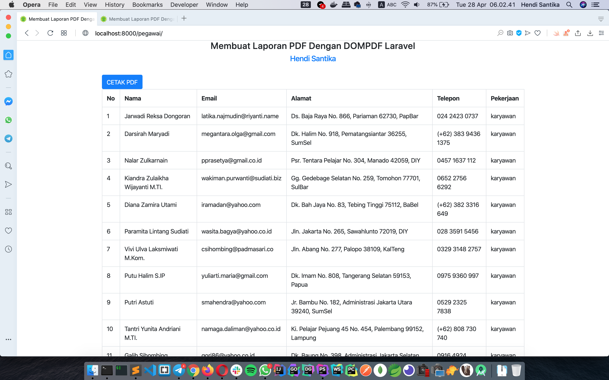
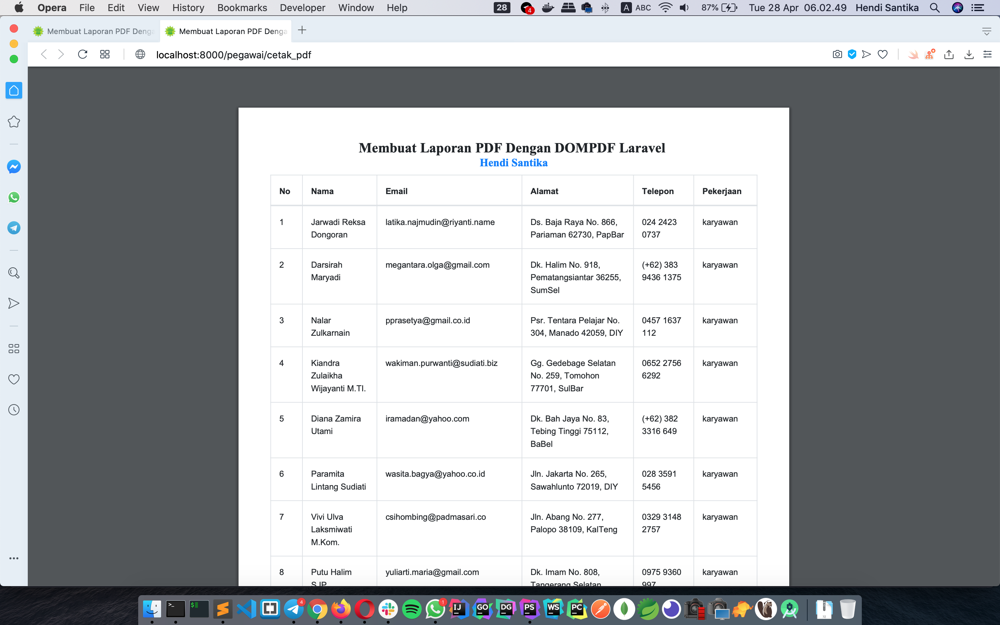

# Laravel PDF
### Things to do list:
1. Clone this repository: `https://github.com/hendisantika/laravel_pdf.git`
2. Go inside the folder: `cd laravel_pdf`
3. Run `cp .env.example .env` & set your desired db name
4. Run `composer install` 
5. Run `php artisan migrate`
5. Run `php artisan serve`
6. Open your favorite browser: http://localhost:8000/pegawai

### Screen shot

Laravel List

Laravel Pagination

